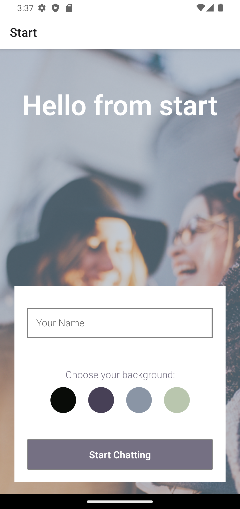
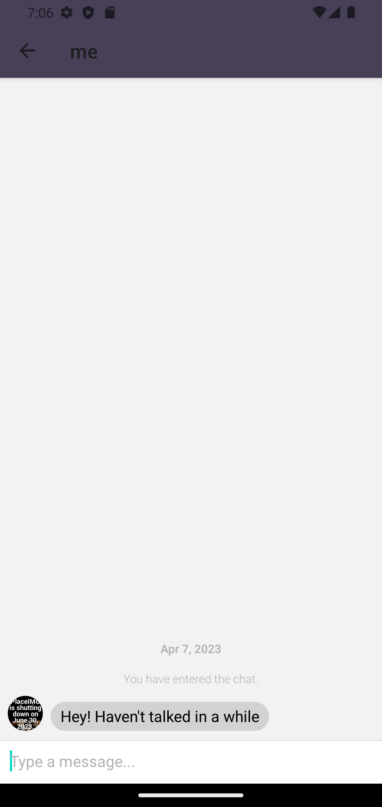
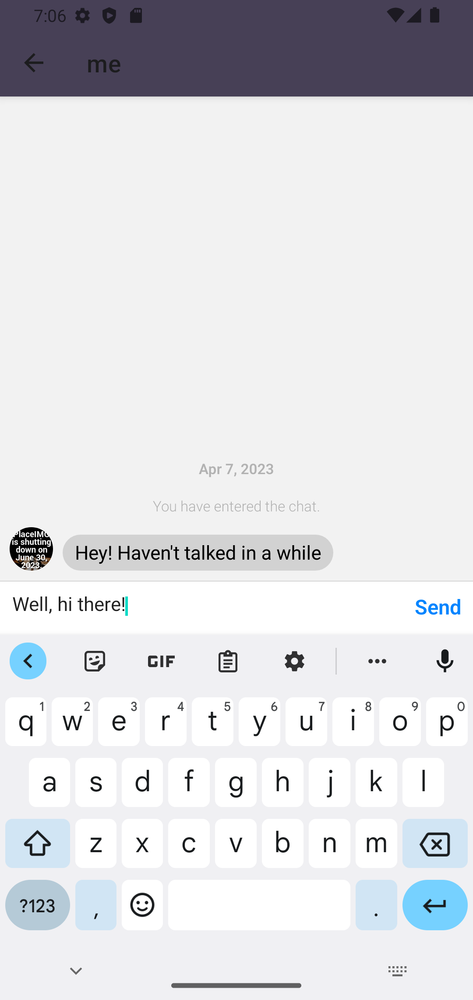
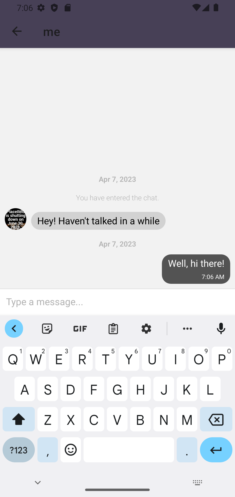

# mobile-chat-app
<h1>Mobile Chat App</h1>
<h2>React Native Mobile Chat App</h2>

A native chat app built with React Native, providing its users with a chat interface along with the option to share images, location data and to store chat data both on and offline.

<h2>Built using</h2>
<ul>
  <li>React Native</li>
  <li>Expo</li>
  <li>Android Studio</li>
  <li>Google Firestore Database</li>
  <li>JavaScript Mobile Development</li>
</ul>

<h2>My Role</h2>
Full-Stack Web Developer

<h2>Objective</h2>
To build a chat app for mobile devices using React Native. The app will provide users with a that interface and options to share images and their location.

<h2>Dependencies</h2>
  
"@react-navigation/native": "^6.1.6", 
    "@react-navigation/native-stack": "^6.9.12", 
    "expo": "~48.0.10", 
    "expo-status-bar": "~1.4.4", 
    "react": "18.2.0", 
    "react-native": "0.71.6", 
    "react-native-screens": "~3.20.0", 
    "react-native-safe-area-context": "4.5.0"

